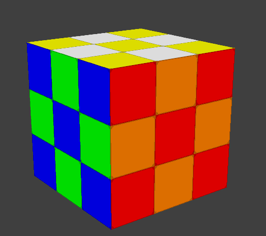

# Rubik-s-Cube

## Description

Rubik's Cube game using Python Ursina 3D Engine.
In game the user can:

### Capabilities

The app is able to do the following:

- Perform R/L/F/D/U rotations
- Perform R'/L'/F'/D'/U' rotations
- Rotate the cube 3d and click different sides
- Undo, redo moves

### Future updates:

- Solve Rubik's cube by clicking a button
- Win visual effects
- Moves displaying and statistics
- Shuffle action

## Setup

Install all dependencies with:

```python3 -m pip install requirements.txt```

To run the program use command:

```python3 main.py```

## Install

Except the dependencies, there is nothing to install.

## Screenshots



