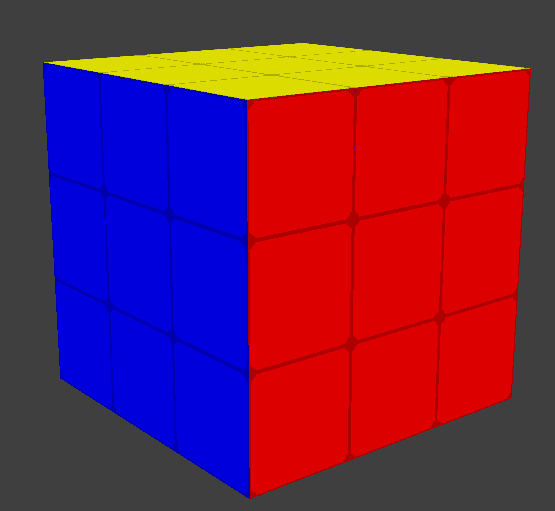

# Rubik-s-Cube

## Description

Rubik's Cube game using Python Ursina 3D Engine.
In game the user can:

### Capabilities

The app is able to do the following:

- Perform R/L/F/D/U rotations  (left mouse click)
- Perform R'/L'/F'/D'/U' rotations (right mouse click)
- Rotate the cube 3d and click different sides
- Undo, redo moves (Ctrl+Z, Ctrl+Y)
- Solve Rubik's cube by clicking 'a' on the keyboard

### Future updates:

- Win visual effects
- Maybe shuffle
- Moves count and statistics

## Setup

Install all dependencies with:

```python -m pip install requirements.txt```

To run the program use command:

```python -m main.py```

## Install

Except the dependencies, there is nothing to install.

## Screenshots




## Source description

```src/solver``` - the solver, using LBL method

````src/grathics```` - the main class. There's the Rubik's cube realization: model creation, colliders
creation and built rotation

````src/utils```` - file where are all common used functions and constants

````src/annotation```` - class where is developed the rubik's cube in arrays. The file is similar to src/graphics

````src/agame```` - The main class. It joins all parts of the project. Here is developed Key_reading, gui starter,
game logic, undo, redo, solver start
