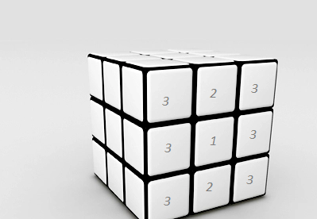

In ```graphics.py``` is implemented the graphic of cube: created model, created sensors(colliders), created cube and
methods for rotating sides. I've created 6 colliders for all possible rotation

In ```game.py``` is the **main** class, are linked our 2 classes. It's like the *business logic* class.

In ```annonation.py```  is implemented analitic's of this game.

How is implemented rotation? Are created colliders, they have priorities(bigger is more important)


This is achieved by adding *(to the needed axes)* ```2*Cube.dt``` and ```Cude.dt``` respectively. ```Cube.dt``` is
an arbitrary very small number which is defined in *main.py*

Analiticly the rubik's cube array look like:

- W[0][0] - at corner with G, R, along G
- R[0][0] - at corner with W, G
- Y[0][0] - at corner with B, R, along B
- O[0][0] - at corner with B, W
- B[0][0] - at corner with R, W
- G[0][0] - at corner with O, W

Every side represents a 2D array like [0...3][0...3]

I've used ```action_trigger``` because Ursina is continously reading the input
and if the user clicks when a animation(of rotation) is playing,
then it'll crash